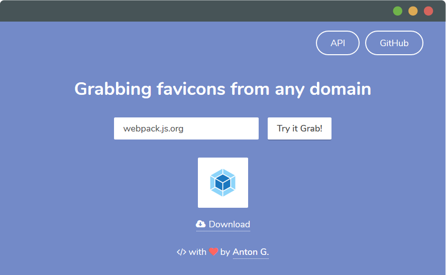

# Favicon Grabber [](LICENSE)

[Favicon Grabber](https://favicongrabber.com/) is an online service to grab favicons from any domain.

<p align="center">
  <a href="https://favicongrabber.com/" target="_blank">
    
    <br>
    Try Grabbing
  </a>  
</p>

## API

Favicon Grabber API is simple and has the one endpoint. For instance, to grab favicons from [digitalocean.com](https://digitalocean.com/) open [https://favicongrabber.com/api/grab/digitalocean.com](https://favicongrabber.com/api/grab/digitalocean.com?pretty=true) in your favorite browser.

### Example Using

Grab icons with `/apple/` mask in `src` property:

```javascript
fetch('https://favicongrabber.com/api/grab/udemy.com')
  .then(response => response.json())
  .then(({ icons }) => icons.filter(({ src }) => /apple/.test(src)))
  .then(icons => icons.forEach(icon => console.log(icon)));
```

For the full description, please see [Service API reference](docs/API.md).

## License
  
The code is available under the [MIT License](LICENSE).
